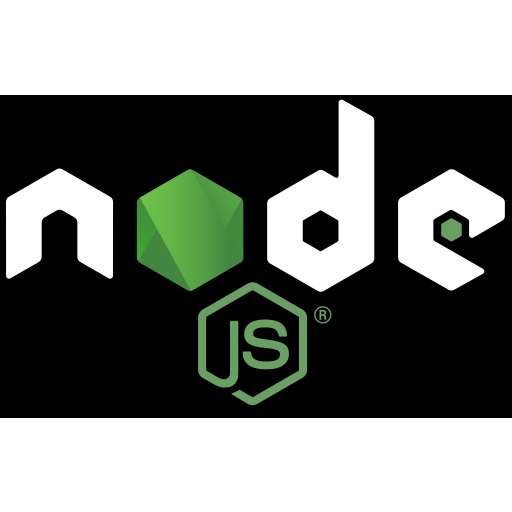

```{r setup, include = FALSE, eval = TRUE}
library(tidyverse)

pacman::p_load(dplyr, ggplot2, janitor, forcats,
               ggchicklet, paletteer, prismatic, scales)
library(xaringan)

knitr::opts_chunk$set(eval = FALSE, tidy = FALSE)

```


```{r xaringan-themer, eval = TRUE, include=FALSE, warning=FALSE}
library(xaringanthemer)
style_mono_light(
  base_color = "#002633",
  text_color = darken_color("#E85A50", 0.5),
  white_color = lighten_color("#2b2d42", 0.95),
  code_inline_color = choose_dark_or_light("#edf2f4", "#edf2f4"),
  header_font_google = google_font("Chivo", "300", "700"),
  text_font_google   = google_font("Chivo", "300", "700"),
  code_font_google   = google_font("Fira Mono"),
  extra_css = list(".hljs-github .hjls" = list("background" = "black"),
                   ".small" = list("font-size" = "70%"),
                   ".small pre .remark-code" = list("font-size" = "75%"),
                   ".small .remark-code" = list("font-size" = "75%"),
                   ".tiny .remark-code" = list("font-size" = "50%"),
                   ".medium .remark-code" = list("font-size" = "90%")
  )
)
```

```{css, include = FALSE, eval = TRUE}
/* Extra CSS */
.hljs-github .hjls {
  background: black;
}
.small {
  font-size: 70%;
}
.small pre .remark-code {
  font-size: 75%;
}
.small .remark-code {
  font-size: 80%;
}
.tiny .remark-code {
  font-size: 60%;
}
.medium .remark-code {
  font-size: 90%;
}

```

  ## Overview

The topic of our conversation will be centered around the Sports Data accessibility problem and how the SportsDataverse developer group is trying to create solutions for addressing it. 

**Slide Link**: [`saiemgilani.github.io/The_SportsDataverse_Initiative/`](https://saiemgilani.github.io/The_SportsDataverse_Initiative/)

**The problems**
* How do we create open-source sports data resources for the community to improve accessibility? 
* How do we make the sports analytics industry more diverse and inclusive?

--

**The solutions**

--

* Building an extensive set of open-source sports data repositories
--

* Create packages to access the data in Python, R, and Node.js
--

* Establish the bench of developers from diverse backgrounds to spearhead projects and make contributions
--

* Create new resources for women's sports to spur reproducible research. 
---
### Before we get started, thank you to:
.pull-left[
#### My collaborators from the `cfbscrapR` team:
* Meyappan Subbiah
* Parker Fleming
<br>

#### My collaborators from the `cfbfastR` team:
* Akshay Easwaran
* Jared Lee
* Eric Hess

#### The creator of [CollegeFootballData.com](https://collegefootballdata.com):
* Bill Radjewski

#### The `nflfastR` team:
* Sebastian Carl
* Ben Baldwin

]
.pull-right[
```{r cfbscrapR-logo, eval = TRUE, out.width = "47%", echo = FALSE}
knitr::include_graphics("https://raw.githubusercontent.com/saiemgilani/cfbscrapR/master/man/figures/logo.png")
```
<br>
```{r cfbfastR-logo, eval = TRUE, out.width = "47%", echo = FALSE}
knitr::include_graphics("https://raw.githubusercontent.com/saiemgilani/cfbfastR/master/man/figures/logo.png")
```
<br>
```{r cfbd-logo, eval = TRUE, out.width = "47%", echo = FALSE}
knitr::include_graphics("https://raw.githubusercontent.com/saiemgilani/The_SportsDataverse_Initiative/main/figures/CFBDLogo.png")
```
<br>
```{r nflverse-logo, eval = TRUE, out.width = "47%", echo = FALSE}
knitr::include_graphics("https://raw.githubusercontent.com/nflverse/nflverse/main/man/figures/logo.png")
```
]

... and the many others that contribute to and support the SportsDataverse

---

### First Things First: Who dis?

Saiem Gilani - Lead Engineer of the SportsDataverse<br><a href='https://twitter.com/saiemgilani' target='blank'></a> <a href='https://github.com/saiemgilani' target='blank'></a>

--
#### What I do

ML Engineer by trade, currently working at Deloitte. Previous industries have included healthcare consulting and medical malpractice, as well as freight shipping and online data science course development. 

--
#### How I got into open-source sports analytics

* Working as an analytics contributor with the folks at TomahawkNation, the FSU SBNation site covering my hometown Seminoles 

* Started contributing on my first open-source sports project in early 2020

* Invited to work on `cfbscrapR` by Meyappan Subbiah

---
### First Things First: Tidyverse?<br> Nah, I don't know her

At the time, I had this much experience in R:

--

* Hardly used the tidyverse outside of Parker Fleming's introductory vignette to `cfbscrapR`.

--

* Never worked on a public package
  - *what do you mean portable, it runs on my machine!*

--

* Never started an Rproject 

--

* Never used git in any truly collaborative fashion
  - *by PR, do you mean short for purrr?*
  
--

* I did have some stats and analytics modeling background in R, so this was my initial foot-hold into the project.

---
### Problems of Open-Source Sports 

One of the more pressing issues facing the community is having contributions in reproducible sports analytics research getting shuttered. 

Those who have been around long enough know how burdensome maintaining a package can be for developers. 

--

You'll see that packages often fall into various states of disarray, for reasons like:
* the developers have a life off GitHub (what?)

* a job or family with increasing demands

* have been ordered to stop working on any public sports work due to their job

* underlying data source changes going undetected

* the project was merely a proof of concept for research

* so so many reasons

---

### The SportsDataverse Initiative `r emo::ji("light_bulb")` 

"...*the idea was to bring together a group of remarkable people, to see if they could become something more. To see if they could work together when we needed them to -- to scrape the data we never could.*"
 
 .pull-right[~ *Nick FuRy* 
 <br>]
<br>
<br>
I had a thought I am sure many of the long-standing members of the sports analytics community has had.

  * *what if getting sports data for analysis was easy?*

  * *what if we worked together to build the data infrastructure for research?*
  
  * *how much further would we get?*
    
---

### What the SportsDataverse is:

* An organization trying to make the sports data and analytics industry more diverse, inclusive, and accessible by providing high-quality resources for end-users and opportunities for practical code skill development for those that join the effort  
   `r emo::ji("light_bulb")` + `r emo::ji("computer")` + `r emo::ji("chart_increasing")` 
   
--

* A community of developers committed to developing and maintaining open-source sports data packages and pipelines as on-going public utilities   
   `r emo::ji("group")` + `r emo::ji("speech_balloon")` + `r emo::ji("coder")` + `r emo::ji("package")`

--

* A set of packages for loading and scraping sports data in R, Python, and Node.js with focus placed on play-by-play data  
<a href="https://www.r-project.org/" target="_blank" alt="R">  </a>  + <a href="https://pypi.org/user/saiemgilani/" alt="Saiem's Python Packages" target="_blank">  </a> + <a href="https://nodejs.org" target="_blank">  </a> 

--

* A set of corresponding data repositories which allow fast loading of the data for users and collectively form one of the largest open-source sports data resources in the public sphere 


---
### College Football
R 
```{r cfbfastR_load_cfb, eval = TRUE, out.width = "40%", echo = TRUE}
cfb_pbp <- cfbfastR::load_cfb_pbp(2021)
```

Python 
```{python sdv_load_cfb, eval = TRUE, out.width = "40%", echo = TRUE}
import sportsdataverse as sdv
cfb_pbp_df = sdv.cfb.load_cfb_pbp(seasons=2020)
```
--
### NFL
R 
```{r nflverse_load_nfl}
# go use the nflverse, wyd
```

Python 
```{python sdv_load_nfl}
import sportsdataverse as sdv
nfl_pbp_df = sdv.nfl.load_nfl_pbp(seasons=2021)
```

---
### Men's College Basketball
R 
```{r hoopR_load_mbb, eval = TRUE, out.width = "40%", echo = TRUE}
mbb_pbp <- hoopR::load_mbb_pbp(2021)
```

Python 
```{python sdv_load_mbb, eval = TRUE, out.width = "40%", echo = TRUE}
import sportsdataverse as sdv
mbb_pbp_df = sdv.mbb.load_mbb_pbp(seasons=2021)
```

--
### NBA
R 
```{r hoopR_load_nba, eval = TRUE, out.width = "40%", echo = TRUE}
nba_pbp <- hoopR::load_nba_pbp(2021)
```

Python 
```{python sdv_load_nba, eval = TRUE, out.width = "40%", echo = TRUE}
import sportsdataverse as sdv
nba_pbp_df = sdv.nba.load_nba_pbp(seasons=2021)
```

---
### Women's College Basketball
R 
```{r wehoop_load_wbb, eval = TRUE, out.width = "40%", echo = TRUE}
wbb_pbp <- wehoop::load_wbb_pbp(2021)
```

Python 
```{python sdv_load_wbb, eval = TRUE, out.width = "40%", echo = TRUE}
import sportsdataverse as sdv
wbb_pbp_df = sdv.wbb.load_wbb_pbp(seasons=2021)
```

--
### WNBA
R 
```{r wehoop_load_wnba, eval = TRUE, out.width = "40%", echo = TRUE}
wnba_pbp <- wehoop::load_wnba_pbp(2021)
```

Python 
```{python sdv_load_wnba, eval = TRUE, out.width = "40%", echo = TRUE}
import sportsdataverse as sdv
wnba_pbp_df = sdv.wnba.load_wnba_pbp(seasons=2021)
```

---
### Function (naming) follows form

* Function names indicate the data source.
  - if the function starts with `load_`, `build_`, or `update_`, the data is coming from the data repository
  - Otherwise, it'll be an abbreviation for the website supplying the data (i.e. `espn_`, `nba_`, `ncaa_`).

--

.split-left[
### Common Scraper<br> Package Design
```{r apidatastore-draw, eval = TRUE, out.width = "47%", echo = FALSE}
knitr::include_graphics("https://raw.githubusercontent.com/saiemgilani/The_SportsDataverse_Initiative/main/figures/api-scraper.png")
```
<br>
]
.split-right[
### SportsDataverse Package Design
```{r apiscraper-draw, eval = TRUE, out.width = "47%", echo = FALSE}
knitr::include_graphics("https://raw.githubusercontent.com/saiemgilani/The_SportsDataverse_Initiative/main/figures/api-datastore.png")
```
<br>
]
---
## SportsDataverse Packages
### Python <a href="https://pypi.org/user/saiemgilani/" alt="Saiem's Python Packages" target="_blank">  </a>

| **Package**     | **Sports Leagues**    | **Repository**    | **Author(s)**   |
|:----------------|:----------------------|:------------------|:----------------|
| sportsdataverse | College Football, NFL, NBA, WNBA, NHL, Men’s and Women’s College Basketball, most collegiate sports | [GitHub][]-[Docs][] | Saiem Gilani  |

  [GitHub]: https://github.com/saiemgilani/sportsdataverse-py/
  [Docs]: https://py.sportsdataverse.org/
  
<br>  
### Node.js <a href="https://nodejs.org" target="_blank">  </a>

| **Package**     | **Sports Leagues**    | **Repository**    | **Author(s)**   |
|:----------------|:----------------------|:------------------|:----------------|
| sportsdataverse | College Football, NFL, NBA, WNBA, NHL, Men’s and Women’s College Basketball, most collegiate sports | [GitHub][1]-[Docs][2] | Saiem Gilani  |
| nfl-nerd        | NFL                                                                                                 | [GitHub][3]-[Docs][3]          | Annie Tran    |

  [1]: https://github.com/saiemgilani/sportsdataverse
  [2]: https://saiemgilani.github.io/sportsdataverse
  [3]: https://github.com/nntrn/nfl-nerd
---
## SportsDataverse Packages
### R <a href="https://www.r-project.org/" target="_blank" alt="R">  </a>

| **Package**     | **Sports Leagues**    | **Repository**      | **Author(s)**   |
| :-- | :-- | :-- | :-- |
| cfbfastR | College Football | [GitHub][25] - [Docs][26] | Saiem Gilani, Akshay Easwaran, Jared Lee, Eric Hess |
| hoopR | NBA and Men’s College Basketball | [GitHub][1] - [Docs][2] | Saiem Gilani |
| wehoop | WNBA and Women’s College Basketball | [GitHub][3] - [Docs][4] | Saiem Gilani and Geoff Hutchinson |
| worldfootballR | EPL, La Liga, Bundesliga, Serie A, Ligue 1, RFPL | [GitHub][7] - [Docs][8] | Jason Zivkovic |
| baseballr | MLB, MiLB, NCAA Baseball | [GitHub][9] - [Docs][10] | Bill Petti |
| hockeyR | NHL | [GitHub][11] - [Docs][12] | Dan Morse |
| fastRhockey | Premier Hockey Federation | [GitHub][13] - [Docs][14] | Ben Howell |
| powerplay | NHL | [GitHub][15] - [Docs][16] | Saiem Gilani |
| cfbplotR | College Sports visualizations | [GitHub][17] - [Docs][18] | Jared Lee |
| cfb4th | College Football Modeling  | [GitHub][19] - [Docs][20] | Jared Lee |
| gamezoneR | Men’s and Women’s College Basketball | [GitHub][5] - [Docs][6] | Jack Lichtenstein |
| puntr | NFL and College Football | [GitHub][21] - [Docs][22] | Dennis Brookner and Raphael LadenGuindon |
| recruitR | Men’s College Sports Recruiting | [GitHub][23] - [Docs][24] | Saiem Gilani |

  [25]: https://github.com/saiemgilani/cfbfastR/
  [26]: https://saiemgilani.github.io/cfbfastR/
  [1]: https://github.com/saiemgilani/hoopR/
  [2]: https://hoopR.sportsdataverse.org
  [3]: https://github.com/saiemgilani/wehoop
  [4]: https://wehoop.sportsdataverse.org
  [5]: https://github.com/jacklich10/gamezoneR/
  [6]: https://jacklich10.github.io/gamezoneR/
  [7]: https://github.com/JaseZiv/worldfootballR
  [8]: https://jaseziv.github.io/worldfootballR
  [9]: https://github.com/BillPetti/baseballr/
  [10]: https://BillPetti.github.io/baseballr
  [11]: https://github.com/danmorse314/hockeyR/
  [12]: https://hockeyr.netlify.app/
  [13]: https://github.com/BenHowell71/fastRhockey/
  [14]: https://BenHowell71.github.io/fastRhockey
  [15]: https://github.com/saiemgilani/powerplay
  [16]: https://saiemgilani.github.io/powerplay
  [17]: https://github.com/kazink36/cfbplotR
  [18]: https://kazink36.github.io/cfbplotR
  [19]: https://github.com/kazink36/cfb4th
  [20]: https://kazink36.github.io/cfb4th
  [21]: https://github.com/Puntalytics/puntr
  [22]: https://puntalytics.github.io/puntr/
  [23]: https://github.com/saiemgilani/recruitR/
  [24]: https://saiemgilani.github.io/recruitR/
  
---
### Thank you

* `cfbscrapR` & `cfbfastR` & `nflverse` teams `r emo::ji("football")` `r emo::ji("laptop_computer")`
* `#CMSAC21 hosts`: Rebecca, Sam, Ron and Carlie `r emo::ji("ice_hockey")`
* The seriously awesome community of developers that helps build and maintain resources `r emo::ji("football")` `r emo::ji("basketball")`
* All y'all for listening in `r emo::ji("cowboy")`

### Learn more

* [`sportsdataverse`.org](https://www.sportsdataverse.org/) 

* [`cfbfastR` docs](https://saiemgilani.github.io/cfbfastR/)

* [`hoopR` docs](https://hoopR.sportsdataverse.org/)

* [`wehoop` docs](https://wehoop.sportsdataverse.org/)